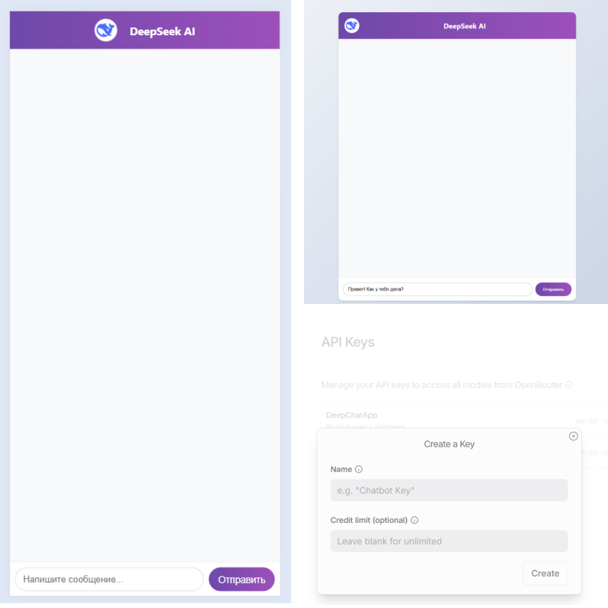

<h1 align="center">🤖 DeepChatApp 🤖</h1>
<p align="center">
    <em>Чат с ИИ на базе DeepSeek через OpenRouter на Flask</em>
</p>

<p align="center">
    
    
    
    
    
    
</p>

---

## 🌟 **О проекте**  
**DeepChatApp** — это веб-приложение на Flask, которое позволяет общаться с AI-моделью **DeepSeek-R1** через API OpenRouter.  
- Минималистичный интерфейс с адаптивным дизайном.  
- Простая интеграция с OpenRouter (ключ API в конфиге).  

---

## 📂 **Структура проекта**
```
DeepChatApp/ 
├── app.py
├── config.py
├── chat_service.py
├── templates/
│    └── index.html
├── static/ 
│    ├── css/
│    │    └── style.css
│    ├── js/
│    │    └── script.js
│    ├── images/
│    │    └── deepseek-icon.png
├── .env.example 
└── requirements.txt
```

---

## 🛠 **Установка и запуск**  

1. **Клонируйте репозиторий**:  
   ```bash
   git clone https://github.com/gaziikk/DeepChatApp.git
   cd DeepChatApp
   ```

2. **Создайте виртуальное окружение**: 
    ```bash
    python -m venv venv
    source venv/bin/activate  # для Linux/Mac
    venv\Scripts\activate     # для Windows
    ```

3. **Установите зависимости**:
    ```bash
    pip install -r requirements.txt
    ```

4. **Создайте файл `.env` в **корне проекта****:    
    ```ini
    API_KEY="ваш_ключ"
    ```

5. **Запустите приложение**:
    ```bash
    flask run
    ```

## 🔑 **Где взять API-ключ?**

1. **Регистрация на OpenRouter**  
   Перейдите на [OpenRouter.ai](https://openrouter.ai) и создайте аккаунт.

2. **Получение ключа**  
   - После входа в аккаунт откройте раздел [API Keys](https://openrouter.ai/settings/keys)  
   - Нажмите **Create Key** и придумайте название для ключа
   - Скопируйте сгенерированный ключ

   <i><span style="color: #DC143C;">*</span> Можно установить кредитный лимит (опционально)</i>

3. **Добавьте в файл `.env` ключ:**
   ```ini
   API_KEY="ваш_ключ"
   ```

## 📸 **Скриншоты**

<p align="center">
    
</p>